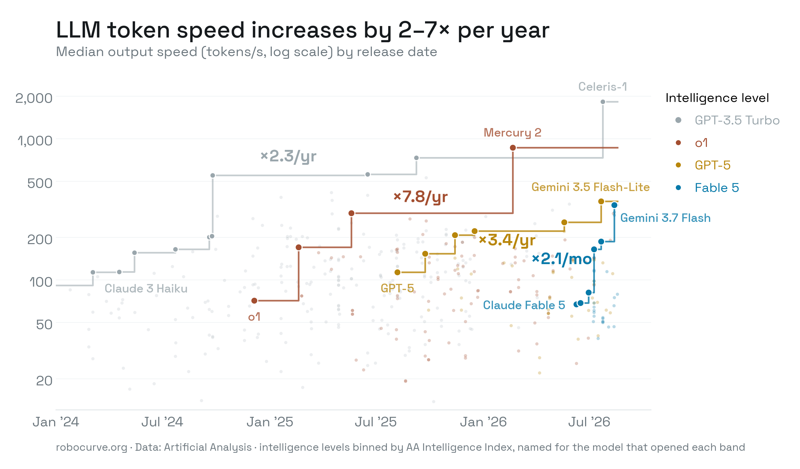

# llm-token-speed

Chart: **"LLM token speed increases by 2–7× per year"** — median output speed
(tokens/s) vs. release date, with a Pareto speed frontier per intelligence
level. Styled in the robocurve editorial grammar (Space Grotesk).



## Method

- **Intelligence levels** are bins of the Artificial Analysis Intelligence
  Index, named for the model that opened each band:
  GPT-3.5 Turbo (II < 20), o1 (20–35), GPT-5 (35–50), Fable 5 (50+).
- **Frontier** = within a level, each model faster than every model released
  before it; the step line is the running max.
- **Rates** are endpoint-averaged: `(last / first) ^ (365.25 / span_days)`,
  shown per-year for curves spanning ≥ 300 days, per-month otherwise
  (annualizing the 9-week-old Fable 5 tier would print a meaningless ×8,762/yr).

## Data

- `data/aa_api_models.json` — Artificial Analysis API v2 snapshot
  (Aug 20, 2026): 610 models; 165 with live speed medians.
- `data/aa_wayback_speeds.json` — 25 monthly Wayback Machine snapshots of the
  AA leaderboard (Jan 2024 – Jan 2026): per-month median tok/s for 420 models.
  Extraction notes in `data/aa_wayback_notes.md`.
- `data/aa_backfilled.json` — 269 models AA no longer benchmarks, with speed
  taken as the median of the first ≤ 3 archive snapshots after each model's
  release. Intelligence scores come from the current API for all models.

Caveat: backfilled speeds reflect serving speed *near release*; live models
use *today's* speed. Consistent with a speed-at-publication framing.

## Regenerate

```sh
uv run src/make_speed_chart.py   # from the repo root; writes plots/
```

To refresh the live snapshot, re-fetch with an AA API key:

```sh
curl -s -H "x-api-key: $AA_API_KEY" \
  https://artificialanalysis.ai/api/v2/data/llms/models > data/aa_api_models.json
```
